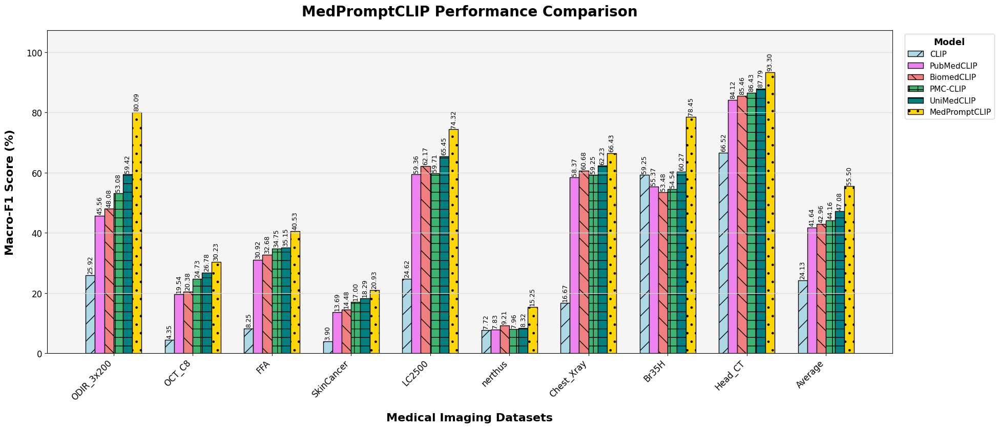

# MedPromptCLIP
Foundational visual language models (VLMs) like CLIP are emerging as a new paradigm in vision due to their strong generalization capabilities. However, their application in the medical domain is limited by the lack of publicly accessible large-scale medical image-text datasets. Existing medical VLMs are typically constrained to single or few imaging modalities, hindering cross-modal adaptability. Soft prompt learning has become a prominent approach for adapting VLMs like CLIP to downstream tasks, but most methods rely on labeled data, which is often impractical to obtain and prone to overfitting, limiting generalization to new datasets. To address this, we propose MedPromptCLIP, a framework that leverages text-only prompt learning to adapt medical CLIP for zero-shot cross-modal disease classification. Specifically, by using large language models (LLMs) to generate detailed disease visual descriptions, such as “What are the visual features of glaucoma in fundus images?”, we train learnable prompt vectors to map standard class templates into a rich LLM-derived feature space, enabling zero-shot classification across imaging modalities (e.g., CT, MRI, fundus). To our knowledge, this is the first work to learn cross-modal prompts using purely text data. Extensive evaluations on diverse medical datasets demonstrate that MedPromptCLIP outperforms existing methods in base-to-new category transfer and zero-shot cross-modal transfer. Additionally, it can be combined with existing image-based prompt methods to further enhance recognition performance.

| CLIP Models   | Zero-Shot Disease Classification | Cross-Modal Disease Classification | Do not require images |
|---------------|-----------------------------------|------------------------------------|-----------------------|
| MedCLIP       | $\checkmark$                      | $\times$                           | $\times$              |
| PLIP          | $\checkmark$                      | $\times$                           | $\times$              |
| FLAIR-$\pi$k  | $\checkmark$                      | $\times$                           | $\times$              |
| PMC-CLIP      | $\checkmark$                      | $\checkmark$                       | $\times$              |
| UniMedCLIP    | $\checkmark$                      | $\checkmark$                       | $\times$              |
| MedPromptCLIP | $\checkmark$                      | $\checkmark$                       | $\checkmark$          |


---


## Acknowledgements

Our code is based on [Protext](https://github.com/muzairkhattak/ProText). We thank the authors for releasing their code. And we achieve FFA dataset from [FFA-Synthesis
](https://github.com/whq-xxh/FFA-Synthesis).


## Installation 
For installation and other package requirements, please follow the instructions detailed in [INSTALL.md](docs/INSTALL.md). 

## Data Preparation
Please follow the instructions at [DATASETS.md](docs/DATASETS.md) to prepare all datasets.

## Model preparation
You can download the PMC-clip ViT-L-14 by https://huggingface.co/ryanyip7777/pmc_vit_l_14.

And put the pmc_vit_l_14_weights.pt into /model,you can download the model by the python code.
```python
import open_clip

model, preprocess_train, preprocess_val = open_clip.create_model_and_transforms('hf-hub:ryanyip7777/pmc_vit_l_14')
tokenizer = open_clip.get_tokenizer('hf-hub:ryanyip7777/pmc_vit_l_14')
```

## Prompt preparation
You can prepare your own prompt or use the provided prompts in the `genprompt` directory. The specific-modality prompts are in the [specific_modal.py](genprompt/specific_modal.py), and the multi-modality prompts are in the [multi_modal.py](genprompt/multi_modal.py).

## Experiment
We conduct three experiment to demonstrate the effectiveness of MedPromptCLIP.Please follow the instructions [EXPERIMENTS.md](docs/EXPERIMENTS.md)

